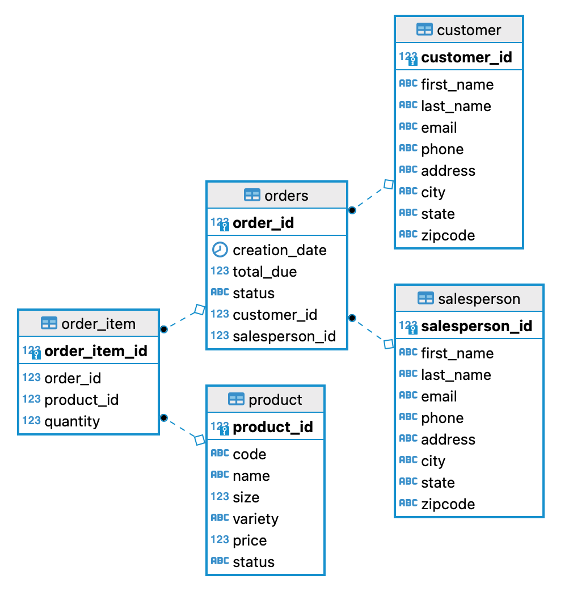

# JDBC Project

## Introduction

In this project, I had to create an application that accesses a database to perform queries using JDBC. In this project, I used Java to use the JDBC API, and I also used Postgres as my database, and Docker to run a container instance of it. I used the IntelliJ IDE, and I also used Maven to manage my project dependencies, such as the PostgreSQL JDBC driver.

## Implementation
### ER Diagram

## Design Patterns

In this project, I made use of the DAO (Data Access Object) design pattern, where I would isolate the logic of the persistence layer away from the actual business logic. In this case, I created two DAO classes: one for the `Customer` model and the other is for the `Order` model.

Then whenever I need to perform any CRUD operations regarding any of the two models in the database, I can simply call the DAO object I created to handle connecting to the database, passing the suitable query for execution, and returning the result if any.

This in regard is similar to the Repository design pattern, where both patterns would perform database operations on the behalf of the user, but the Repository design pattern is more domain-centric, where it is closer to the business layer of the application, while the DAO design pattern is more table-centric, where it is closer to the actual data of the application itself. I can have both, and have a repository use the DAO to perform operations on its behalf before passing it back to the business layer. For this project, it's sufficient to just use the DAO design pattern.

## Test
How you test your app against the database? (e.g. database setup, test data set up, query result)

I first set up a database in Postgres running on Docker, by using some SQL files that were created beforehand that would construct the tables and feed in some sample data. Then I would test the app manually by running the implemented methods that I created in my DAO, and see if it matches the result that I would get if I run the command through the `psql` CLI.

Based on my testing, I can confirm that all my implementations work as they should.
