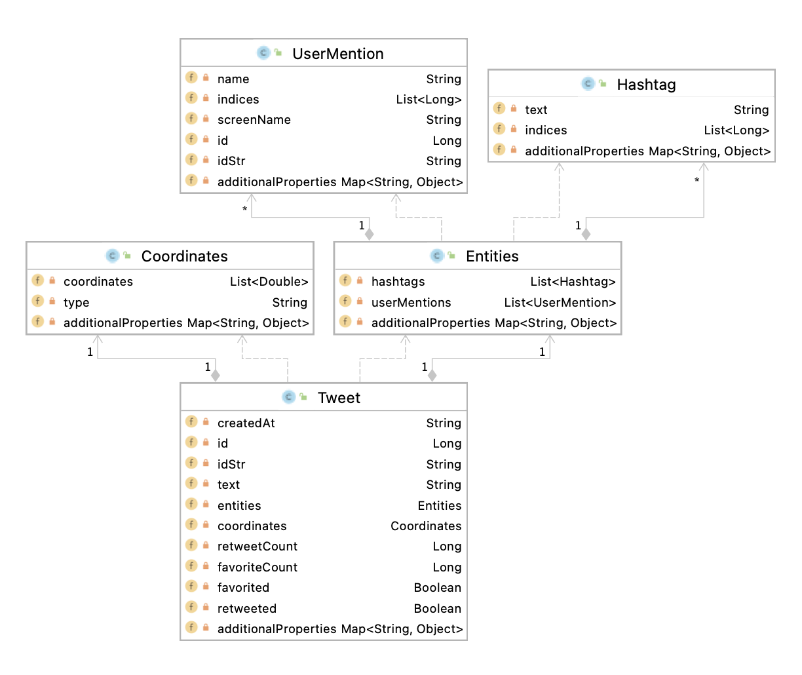

# Twitter Project

In this project, I had to create an application that can post, show, or delete tweets using Twitter's REST APIs. The codebase was written in Java, and I used libraries such as HTTP and OAuth to help with sending and receiving requests. I also used the Jackson library to handle JSON objects. As for the overall build process, I used Maven to handle it along with any dependencies that are needed by the application. Testing was done using JUnit and Mockito. The application was then deployed using Docker.

## Quick Start

### Building and running from the Jar

First, you must export the following environment variables:

- `consumerKey`: The consumer key given by Twitter
- `consumerSecret`: The consumer secret key given by Twitter
- `accessToken`: The access token which would have read/write access
- `tokenSecret`: The secret key for the access token

Then, you can create an Uber jar by executing:

````bash
mvn clean package
````

This will clean the `target` folder, and build the application. It will also run through all the test cases to verify that the application would work as intended.

You can then run the application by doing:

````bash
java -jar twitter-1.0-SNAPSHOT.jar post|show|delete [options]
````

### Running through Docker

Assuming that you wanted to build the container from scratch, you must first build the Uber Jar by going through the steps above. Then, you must execute the following:

````bash
docker build -t <username>/twitter .
````

This will build the container, in which you can then run the container and execute the application with the arguments you pass in:

````bash
docker run --rm -e consumerKey -e consumerSecret -e accessToken -e tokenSecret <username>/twitter show|post|delete [options]
````

You can of course use the image that I deployed by replacing `<username>` with `jbrar`.

## Design

### UML diagram


The app is essentially an integration of multiple components: the app/main component, the controller, the service component, and the DAO component.

#### Application Component

This is essentially a component that constructs all the other objects needed to run this Twitter project. It would construct the `TwitterHttpHelper` object and use it to construct a new `TwitterDao` instance, which will then get used to create a new `TwitterService` instance, and that will be used to create a new `TwitterController` object. The application component also performs some sanity checks on the user's arguments before it passes them into the `Controller` object.

#### Controller

The controller component is the component that would handle the user's argument passed in by the application layer and performs any transformations needed to have the service layer provide service for the given inputs. Afterwards, it passes the results back to the application layer. This would involve doing further sanity checks, and passing the correct arguments to one of the service methods that the `Service` object provides.

#### Service Component

The service component is responsible for performing validation upon the assigned parameters to ensure that the request is syntactically correct. It will then call the correct method of its DAO instance and return the results to the upper layers.

#### DAO Component

The DAO component is the component that performs the underlying communication with Twitter's servers. For the given parameters, the DAO constructs the appropriate URI according to Twitter's REST APIs and uses its `HttpHelper` instance to facilitate the communication to Twitter's servers. It would send the request and receive the response, and then return the result to the upper layers.

## Models

For this project, the `Tweet` model has been made to reflect the actual Tweet JSON object that would be returned by Twitter's REST APIs. Some modifications were made so that the model would be more concise, and would sufficiently fit the use case at hand. The diagram below shows the `Tweet` model and its dependencies.



## Spring

The dependencies were managed by having the codebase adhere to the concept of inversion of control, and the dependency injection design pattern. Spring annotations like `@Component`, `@Controller`, `@Service`, and `@Repository` were used to specify that the given class is a `Bean` and its stereotype. The `@Autowire` annotation was used before each constructor to indicate Spring that it must inject the dependencies through the constructor.

Three different approaches in using Spring were tested in this project's implementation. The first way was doing in `TwitterCLIBean` where I would manually create the beans themselves, and inform the Spring framework that it can receive a bean from a method by using the `@Bean` annotation before the method. The second approach avoids me having to do the manual work in creating the objects myself by making use of the annotations that I said earlier. In the `TwitterCLIComponentScan` class I used the `@ComponentScan` annotation to scan through the specified packages and finds the `Beans` and inject the dependencies for me.

The last approach is the approach that I decided to deploy, and that is to use SpringBoot to manage my dependencies. SpringBoot uses Spring under the hood and allows me to use its functionality without having to write a lot of boilerplate code. I used the `@SpringBootApplication` annotation to help me set up my application using the default settings for Spring. I simply specified where to find the `Beans` and it performs the dependency injection for me.

# Test

As for testing, I used JUnit 4 and Mockito. For each main component in the application, I wrote an integration test, and some unit tests to sufficiently test their functionality and behaviour.

Integration tests are when I try to test the components and their submodules together as a group. This would involve me using JUnit as a test runner, and simply running a single test case to collectively test all of a component's functionality. This would use the genuine components that I had implemented, so I would have environment variables set up so that the components will be able to send requests to Twitter's servers.

Unit tests are when I try to test each component individually. For each component I would test, I would have to test each method, and all the possible edge cases that it could have. But because the component can rely on other components, I had to use Mockito to mock those dependencies and their behaviour, so that I would just be testing the component itself in isolation.

## Deployment

In terms of deployment, I used Docker to containerize my application and push it to my Docker Hub repository. I had created my Dockerfile, where I defined my image to be using the `openjdk:8-alpine` image, which is the bare minimum to run any Java 8 application, and I copied the app's Uber Jar over and set the image to run the Jar upon the running the container.

The steps I took are similar to what was described in the **Quick Start** guide:

````bash
# Build the Uber Jar
mvn clean package

# Create the image
docker build -t <username>/twitter .

# Push the image to your repo
docker push <username>/twitter
````

# Improvements

1. The Show Tweet functionality could be improved by allowing the user to also search for Tweets by keywords.
2. The app can have a new feature where it would allow users to queue Tweets that they want to post at some particular times, and the app will post the Tweets when their time comes. This would involve the app to always be running so that it can listen for new requests.
3. The user experience can be improved by making a GUI for the application. The GUI will provide type hints if the user is inserting an invalid input, and it can report the results back to the user in a more elegant way.
