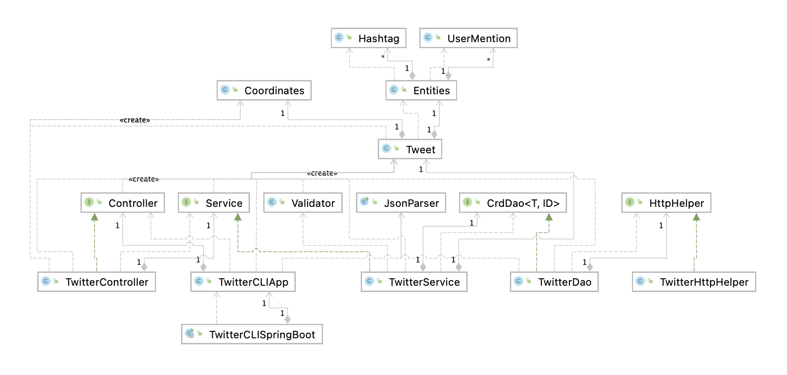

# Twitter Project

(50-100 words)
What does this app do? What technoglies you have used? (e.g. Twitter REST API, HTTP client, mvn, Java libs, docker etc..)

In this project, I had to create an application that can post, show, or delete tweets using Twitter's REST APIs. The codebase was written in Java, and I used libraries such as the HTTP and OAuth to help with sending and receiving requests. I also used the Jackson library to handle JSON objects. As for the overall build process, I used Maven to handle it along with any dependencies that are needed by the application. Testing was done using JUnit and Mockito. The application was then deployed using Docker.

## Quick Start
- how to package your app using mvn?
- how to run your app with docker?

### Building and running from the Jar

First, you must export the following environment variables:

- `consumerKey`: The consumer key given by Twitter
- `consumerSecret`: The consumer secret key given by Twitter
- `accessToken`: The access token which would have read/write access
- `tokenSecret`: The secret key for the access token

Then, you can create an Uber jar by executing:

````bash
mvn clean package
````

This will clean the `target` folder, and build the application. It will also run through all the test cases to verify that the application would work as intended.

You can then run the application by doing:

````bash
java -jar twitter-1.0-SNAPSHOT.jar post|show|delete [options]
````

### Running through Docker

Assuming that you wanted to build the container from scratch, you must first build the Uber Jar by going through the steps above. Then, you must execute the following:

````bash
docker build -t <username>/twitter .
````

This will build the container, in which you can then run the container and execute the application with the arguments you pass in:

````bash
docker run --rm -e consumerKey -e consumerSecret -e accessToken -e tokenSecret <username>/twitter show|post|delete [options]
````

You can of course use the image that I deployed by replacing `<username>` with `jbrar`.

## Design
### UML diagram



explain each component(app/main, controller, service, DAO) (30-50 words each)

The app is essentially an integration of multiple components: the main component, the controller, the service component, and the DAO component.

#### Main Component: 

## Models
Talk about tweet model
## Spring
- How you managed the dependencies using Spring?

# Test
How did you test you app using Junit and mockito?

## Deployment
How did you dockerize your app.

# Improvements
- Imporvement 1
- Imporvement 2
- Imporvement 3