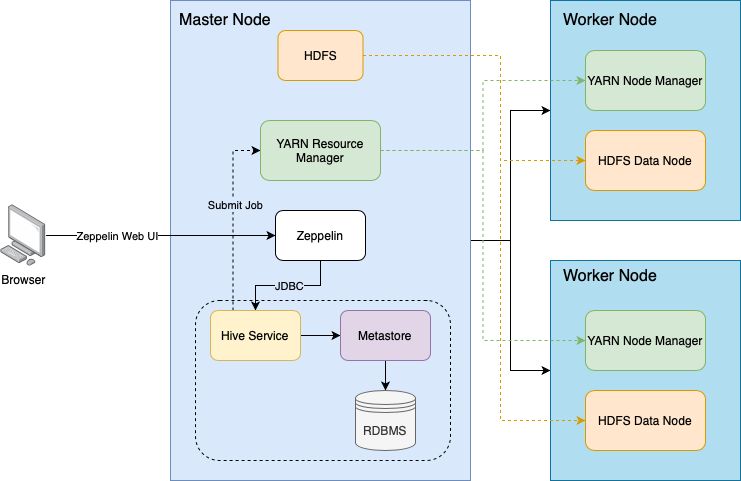
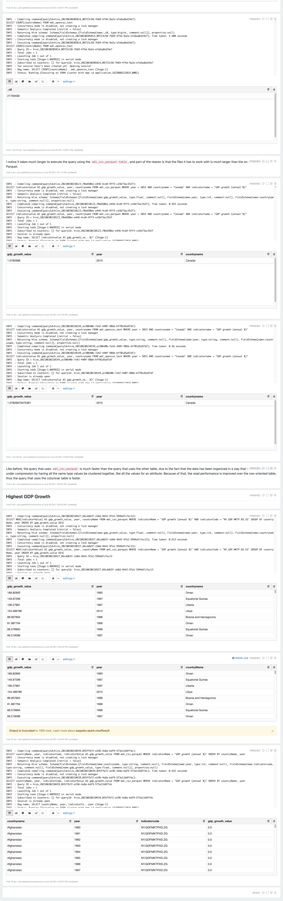

# Hadoop Project

## Introduction

The purpose of this project is to make use of Apache Hadoop to process big data given by an analytics team. Hadoop enabled me to make use of multiple machines to distribute the workload, and I was able to make use of Apache Hive, which allows me to execute SQL queries using the cluster.

## Hadoop Cluster

In terms of the architecture, it would consist of us using the browser to access the Apache Zeppelin server that is running from a Google Cloud Hadoop cluster. From there, we would execute queries that would call Hive to perform its services on translating our HSQL queries to MapReduce code that Hadoop can execute on its cluster, using YARN and the data provided in its HDFS.

In this project, I had set up a Hadoop cluster on the Google Cloud Platform with 1 master node and 2 worker nodes. Each node has the following specifications:

- 2 vCPUs
- 12 GB of RAM
- 100 GB of storage (HDD)

## Hive Project

In terms of how I optimized the Hive queries in this project, I used a table that is partitioned by year. This would improve the performance for queries that involve the year attribute. I had also used a columnar table, which drastically reduced the amount of space that the data needs to take, so loading the data from disk will take less time than it did before. This would translate to better query performance since we would take less time.

## Improvements

1. Make further use of partitions or columnar tables to improve the performance of more queries.
2. Use Apache Spark for more queries, since it performs significantly better than Apache Tez, the execution engine that Hive uses.
3. Experiment with a different number of worker nodes, and nodes with different specs to see how it would impact the performance.
