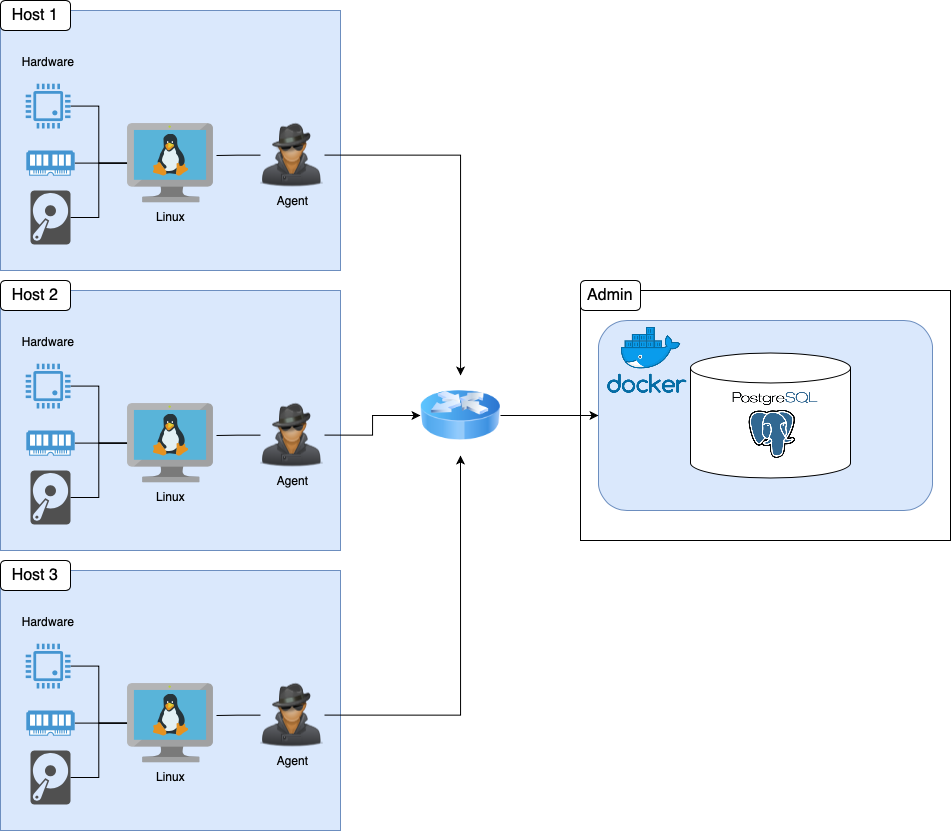

# Linux Cluster Monitoring Agent
This project is under development. Since this project follows the GitFlow, the final work will be merged to the master branch after Team Code Team.

# Introduction
In this project I had to implement a monitoring system that keeps track of the host hardware specifications and usage, and stores them in a database. The users of this project are anyone who has a cluster of machines as part of their project, and they need to determine whether they need to scale vertically or horizontally to fit their needs. I have used Bash, Docker, Postgres, and Git in my implementation. As for testing, it was done manually by on a CentOS virtual machine on the Google Cloud Platform.

# Quick Start
````bash
# Create and run a psql instance
./scripts/psql_docker.sh create [username] [password]

# Create the tables
export PGPASSWORD=[password]
psql -h localhost -U [username] -c "CREATE DATABASE host_agent;"
psql -h localhost -U [username] -d host_agent -f ./sql/ddl.sql

# Insert hardware specs data into the database
./scripts/host_info.sh localhost 5432 host_agent [username] [password]

# Insert hardware usage data into the database
./scripts/host_usage.sh localhost 5432 host_agent [username] [password]

# Crontab setup
crontab -e
# Add this in your crontab file
* * * * * bash /global/path/to/host_usage.sh localhost 5432 host_agent postgres password > /tmp/host_usage.log
````

# Implementation

The project was implemented in 4 main steps:

1. First, I had to create a Bash script that can create a Docker container running Postgres and it can start or stop the container. The Postgres container would run in the background, and it will store host hardware specification and their hardware usage.
2. Then, I had to make a DDL file using PostgreSQL that defines two tables inside the `host_agent` database: `host_info` and `host_usage`. The `host_info` table would store information about the hosts' hardware specs, while the `host_usage` table stores information about hosts' hardware usage, such as how much of CPU is being used, and how much free memory does it have. The file assumes that I have created the `host_agent` database beforehand.
3. Next, I had to make the `host_info.sh` and `host_usage.sh` scripts to actually fetch for the desired information and commit it to the database. This required me to use Bash and PostgreSQL.
4. Finally, I had to make some SQL queries to answer business related questions such as knowing whether we need to scale up servers. This can be determined from queries that return the average memory usage or hosts that failed. For this part, I had to use PostgreSQL.

## Architecture



## Script Descriptions

- `psql_docker.sh`: This is the script that can create the jrvs-psql Postgres Docker container, and it also has the ability to start or stop the container. As part of the container creation process, it also creates a pgdata volume for the container to store the database.
- `host_info.sh`: This script runs once on the host machine to gather its hardware specifications such as CPU architecture and total memory, and commit this data to the Postgres database.
- `host_usage.sh`: This script would run every minute on the host machine, with the help of crontab, to gather information about its hardware usage, such as how long the CPU been idle for, and the current amount of free memory; and commits this data to the Postgres database.
- `ddl.sql`: This script automates the process of creating the `host_info` and `host_usage` table under the `host_agent` database in Postgres. The `host_agent` database must be created first before running this script.
- `queries.sql`: This script sends queries to the Postgres database and reports back the following:
  
    - A table of hosts, number of CPUs, and their total memory grouped by the number of CPUs and ordered by their total amount of memory
    - A table of hosts, their average free memory for some 5 minute interval, and the timestamps for those 5 minute intervals.
    - A table of hosts, their number of `host_usage` data sent in some 5 minute interval, and the timestamps for those 5 minute intervals for all hosts that have sent less than 3 `host_usage` data in some 5 minute interval.
    
  The first table gives the user a good reference to go back to should they need to know how many CPUs or total memory that a particular host have. The second table is useful in knowing if any particular host is running out of memory, and this is important to know if the user need to scale up the servers so that it wouldn't cause any interruptions to their business core services in the future. The last table shows the user of any host failures. This is crucial to know so that the user would take immediate action in bringing their servers back online, and take further actions in ensuring that it won't happen again, at least in the immediate future.

## Script Usage
````bash
# psql_docker.sh usage:
./psql_docker.sh [create/start/stop] [username] [password]

# host_info.sh usage:
./host_info.sh [host] [port] [database] [username] [password]

# host_usage.sh usage:
./host_usage.sh [host] [port] [database] [username] [password]
````

## Database Modeling

| Tables | Properties | Constraints |
| --- | --- | --- |
| host_info |  |  |

# Test

I tested the bash scripts and SQL queries manually in a VM instance on the Google Cloud Platform. The VM instance was running CentOS 7, and it had Docker installed. The result of this testing was that every script and queries ran successfully according to their specifications.

# Improvements

In this project, there are some key areas that can be improved to overall improve the functionality of the host agent:

- The host agent could be made to detect hardware changes, by having it so that upon every reboot, it runs the host_info.sh script and pass the hardware information to the Postgres database so that it would always have the latest up-to-date hardware specs.
    