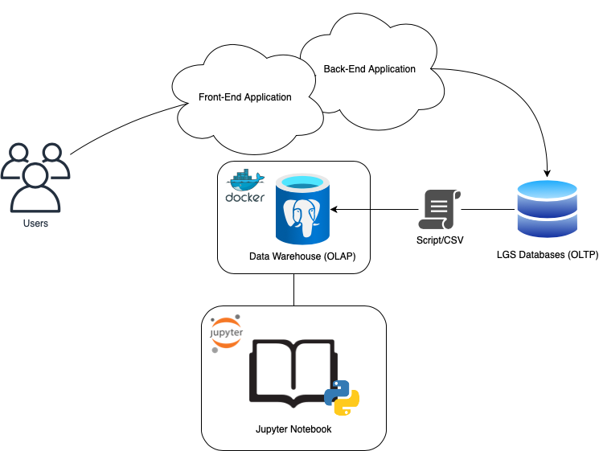

# Python Data Analytics Project

## Introduction

To improve a business's operations, I was assigned to look into the company's transaction data and analyze their customers' shopping behaviour, and determine how the business can go about in their targeting marketing campaign. I used Python as my main language for analyzing the data. I also used Python libraries such as Pandas, Matplotlib, NumPy, and SQLAlchemy. All my work was done in a Jupyter notebook, and the data was accessed either their given CSV file or Postgres database, which ultimately came from their data warehouse.

## Implementation

### Project Architecture

The overall architecture begins with the users visiting the company's web application, which consists of both the front-end and the back-end. After the users have made their transactions through the front-end, it gets recorded into the company's database using their back-end application. Then a script or CSV is constructed from this database so that the data gets imported into the company's data warehouse, which is running from a Docker container.

As for analysis, it is done using a Jupyter notebook that can connect to the data warehouse, and analyze the data so that I can help better the company's operations. The notebook runs from a Jupyter server.

### Data Analytics and Wrangling

- Create a link that points to your Jupyter notebook (use the relative path `./retail_data_analytics_wrangling.ipynb`)
- Discuss how would you use the data to help LGS to increase their revenue (e.g. design a new marketing strategy with data you provided)

All the data analytics can be found from this [notebook](./retail_data_analytics_wrangling.ipynb).

The major part of this analysis is the one on Recency, Frequency, and Monetary (RFM). I took all the customers and divided them up into 11 groups depending on their recency (how long has it been since they last bought an item), frequency (how many purchases they made), and their monetary value (how much did they spend).

From the results that I have found, I can state a few facts on the company's customers so that the company can decide how they are going to market their products to them.

This company currently has about 852 customers that are considered to be **Champions**, meaning that they are extremely loyal and contribute the most to the company's profit. They contributed on average about $10,795.52, and they tend to be about 30 days apart when it comes to their last purchases. The company does not need to worry about these customers.

The company does need to worry about customers that are in the **Can't Lose** category. They are 71 customers that have contributed on average of about $8355.68, but their last purchase is on average about 352 days apart. Their contribution makes them the second to **Champion**, and the company should take active measures to not lose these customers, by having their marketing department focus more on them in their promotions.

There are also other categories such as the **New Customers** category, where there are about 56 new customers that have contributed on average about $356.26, and they have about a month gap since their last purchases. But, they all bought on average 1 item, so there isn't much we can conclude about their actual loyalty. In terms of marketing, the company can attempt to entice them further, but they shouldn't spend so much energy compared to having to do so for other critical categories.

The company can do further analysis with the remaining categories from the Jupyter notebook.

## Improvements

1. Express the RFM data using a pie chart to help better visualize the proportion of customers in each segment.
2. Build a pipeline that would get data from the LGS database to their data warehouse automatically.
3. Analyze the items that are bought by the customers, and determine which ones are most commonly bought so that the company can make a promotion on them.
