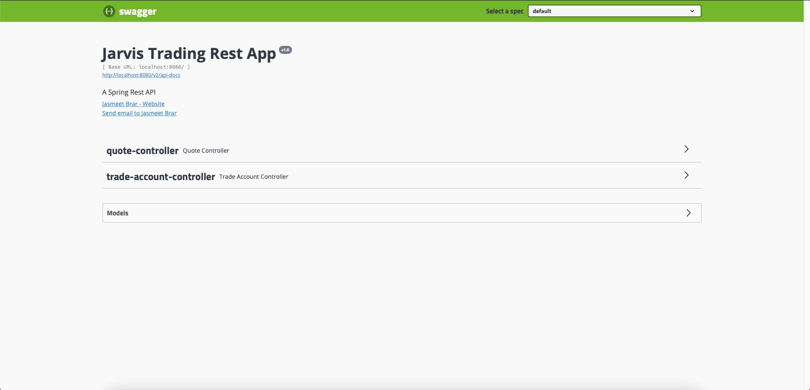
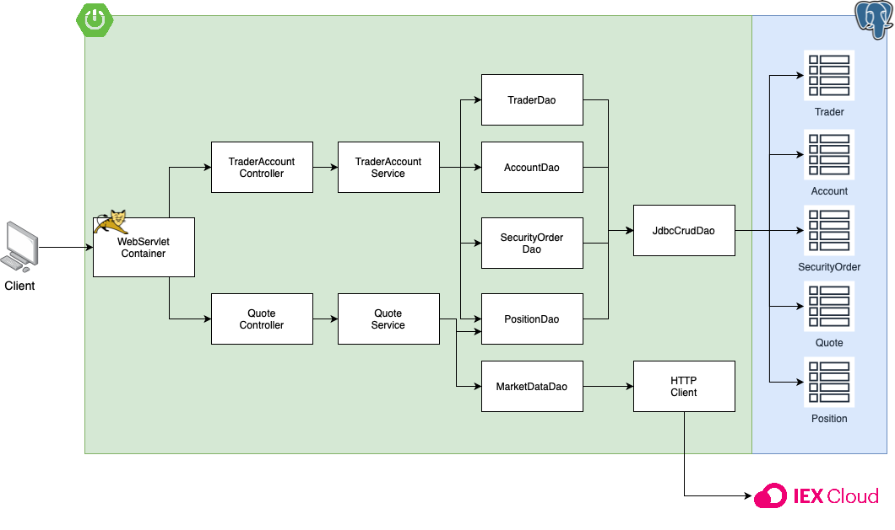

# Spring Boot Project

## Introduction

In order to replace a legacy trading system needed by Jarvis, I was set out to construct a new trading platform that is more scalable and maintainable. This system allows users to fetch stock information for any company, create and manage accounts, and perform operations with quotes . In terms of the technologies, I have used Java to implement the trading system, and I have used Spring Boot to help manage dependencies, and instantiate an Apache Tomcat server for the application to communicate with the client. In terms of testing, I have used JUnit 4 to perform integration testing on various components. As for deployment, I have used Maven to help package my application and its dependencies in an Uber Jar, which would be placed in a final image.

## Quick Start

To get started, you can pull this repo and ensure that you have Docker installed in your system. You would also need to get an IEX Cloud API key so that the system is able to fetch for the latest stock information.

Once you have that, you can start off by going into the `psql` directory, and execute the following:

````Bash
docker build -t trading-psql .
docker image ls -f reference=trading-psql
````

This will create a Docker image for our Postgres database, containing all of our relations. Then we need to go back to the root directory, and build the trading system by executing the following:

````Bash
docker build -t trading-app .
docker image ls -f reference=trading-psql
````

To run our application, we first need to make a Docker network for our containers to use:

````Bash
docker network create --driver bridge trading-net
````

Then we can run our containers:

````Bash
# Run our Postgres database container
docker run -d --name trading-psql \
-e POSTGRES_USER=$PSQL_USER \
-e POSTGRES_PASSWORD=$PSQL_PASSWORD \
-v pgdata:$PGDATA_PATH \
--network trading-net -p 5432:5432 trading-psql

# Run our trading app container
docker run -d --name trading-app-dev \
-e "PSQL_HOST=trading-psql" \
-e "PSQL_PORT=5432" \
-e "PSQL_DB=jrvstrading" \
-e "PSQL_USER=$PSQL_USER" \
-e "PSQL_PASSWORD=$PSQL_PASSWORD" \
-e "IEX_PUB_TOKEN=$IEX_PUB_TOKEN" \
--network trading-net \
-p 8080:8080 -t trading-app
````

`$PSQL_USER` and `$PSQL_PASSWORD` is the username and password for a Postgres account. `$PGDATA_PATH` is the path to the directory that we are trying to use as a volume for the trading-psql container. `$IEX_PUB_TOKEN` is the public token that would allow us to access IEX Cloud APIs.


From here, we can use any application to send our requests to the trading system such as Postman. We can also access all of its APIs using Swagger, by going to: `http://localhost:8080/swagger-ui.html`



## Implementation
### Architecture
- Draw a component diagram that contains controllers, services, DAOs, SQL, IEX Cloud, WebServlet/Tomcat, HTTP client, and SpringBoot. (you must create your own diagram)
- briefly explain the following components and services (3-5 sentences for each)
    - Controller layer (e.g. handles user requests....)
    - Service layer
    - DAO layer
    - SpringBoot: webservlet/TomCat and IoC
    - PSQL and IEX
  


### REST API Usage
#### Swagger
Swagger is an interface that allows users to access and use an application's APIs all in the browser, without needing to go into its source code. It's useful in making our APIs clear to the users without adding any complexities. 
#### Quote Controller
- High-level description for this controller. Where is market data coming from (IEX) and how did you cache the quote data (PSQL). Briefly talk about data from within your app
- briefly explain each endpoint
  e.g.
    - GET `/quote/dailyList`: list all securities that are available to trading in this trading system blah..blah..
  
The Quote Controller allows the users to get the latest stock information for all the quotes they have in their daily list, and update them. It also allows users to add tickers to their own daily list. The market data itself is coming from the IEX Cloud APIs, and the data is cached in a Postgres database.

Endpoints:

- GET `/iex/ticker/{ticker}`: Get the latest stock information for the given ticker
- PUT `/iexMarketData`: Update the stock information for every quote in the daily list
- PUT `/`: Add the given quote to the daily list
- POST `/tickerId/{tickerId}`: Get the quote for the given ticker from IEX Cloud and save the information in the daily list
- GET `/dailyList`: Get the daily list

#### Trader Controller
- High-level description for trader controller (e.g. it can manage trader and account information. it can deposit and withdraw fund from a given account)
- briefly explain each endpoint

The Trade Account Controller allows the users to traders and account information, and also deposit or withdraw funds from a trader's account.

Endpoints:

- POST `/firstname/{firstname}/lastname/{lastname}/dob/{dob}/country/{country}/email/{email}`: Add a new trader to the database with the given information.
- POST `/`: Add a new trader to the database with the given information from the request's body in the JSON format.
- DELETE `/traderId/{traderId}`: Delete the trader with the given ID, as long as the account is empty, and it has no open positions.
- PUT `/deposit/traderId/{traderId}/amount/{amount}`: Deposit funds to a trader's account using the supplied trader's ID and amount fields.
- PUT `/withdraw/traderId/{traderId}/amount/{amount}`: Withdraw funds from a trader's account using the supplied trader's ID and amount fields.

## Test

The application was tested using JUnit 4 for pretty much every component. At each level, I would have integration tests setup so that it would test if the component can function correctly when given other real components. The code coverage for all test components are at least 60%.

## Deployment

In terms of deployment, Docker was used to containerize my Postgres database, and my application so that it can run on any machine with Docker installed.

The Postgres database container was made using the `postgres:9.6-alpine` image, and two SQL scripts were copied to its `docker-entrypoint-initdb.d` directory so that Postgres would load the files if it finds that its database is empty.

The trading app container was made by moving our source code into a `maven:3.6-jdk-8-slim` image, and get Maven to package our application. Then we move the produced Jar file to a `openjdk:8-alpine` image, and set its entrypoint to execute Jar file in a JVM, which will run the web server.

## Improvements

1. I would implement the Order controller and the Dashboard controller to further extend the application's functionalities.
2. The application can get a new feature where it would present to the users the stocks that have changed the most over some period of time.
3. I would make a front-end for this application, and have the information be presented in a graph. It would make it more elegant for the users to manage their accounts, and view stock information.